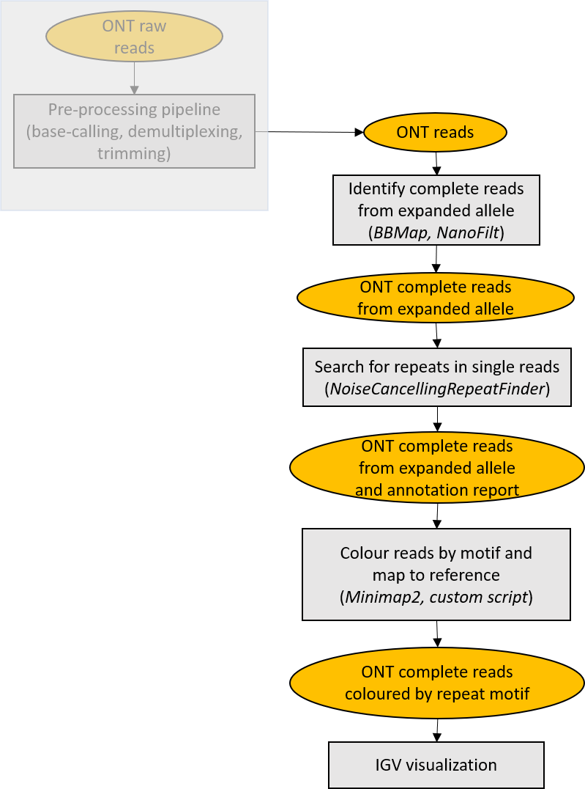
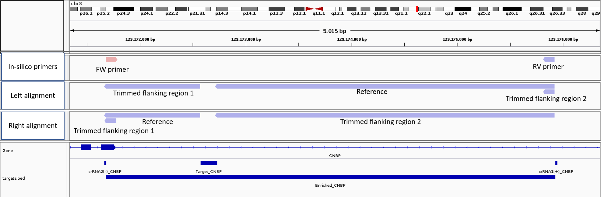
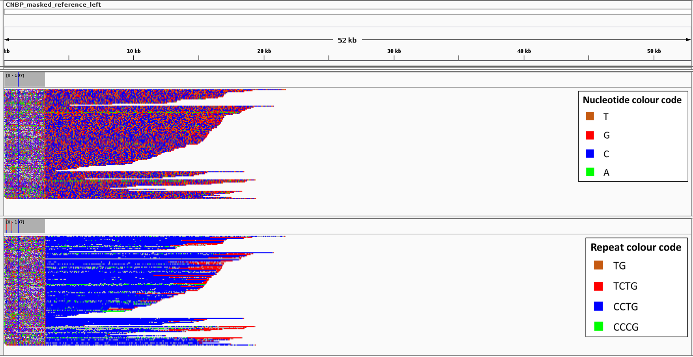

# MosaicViewer

**MosaicViewer** is a pipeline for schematic visualization of expanded alleles with somatic mosaicism. Due to mosaicism, long sequencing reads can not be collapsed into an accurate consensus sequence. Therefore, only repeat annotation of each single read can be performed. MosaicViewer integrates tool for performing repeat annotation of noisy long reads, performs alignment to left and right flanking regions, and generates "simplified" reads, for easier identification of alternative motifs in IGV visualization. The pipeline has only been used for CNBP expanded alleles, but its applicability can be extended with minor modification.

<p align="center">
  
</p>


## Getting started

**Prerequisites**

* Miniconda3.
Tested with conda 4.8.1.
```which conda``` should return the path to the executable.
If you don't have Miniconda3 installed, you could download and install it with:
```
wget https://repo.anaconda.com/miniconda/Miniconda3-latest-Linux-x86_64.sh
chmod 755 Miniconda3-latest-Linux-x86_64.sh
./Miniconda3-latest-Linux-x86_64.sh
```

* A fastq file containing reads from one sample. Tested with files produced with Guppy v3.4.5 specifying ```--pt_scaling TRUE``` parameter.
* A fasta file containing reference sequence (e.g. hg38)
* Coordinates of flanking regions (e.g. used for designing Crispr-Cas9 guides)

**Installation**

```
git clone https://github.com/MaestSi/MosaicViewer.git
cd MosaicViewer
chmod 755 *
./install.sh
```

A conda environment named _MosaicViewer\_env_ is created, where seqtk, minimap2, samtools, NoiseCancellingRepeatFinder, BBMap and R with package Biostrings are installed. Another conda environment named _NanoFilt\_env_ is created, where NanoFilt is installed. 
Then, you can open the **config_MosaicViewer.sh** file with a text editor and set the variables _PIPELINE_DIR_ and _MINICONDA_DIR_ to the value suggested by the installation step.

## Usage
As a first step, open the **config_MosaicViewer.sh** file with a text editor and set all the variables. Depending on the reference coordinates set in the file, in-silico PCR primers and flanking regions for performing left or right alignment are extracted.

<p align="center">
  
</p>

**MosaicViewer.sh**

Usage: ./MosaicViewer.sh

Note: the file **config_MosaicViewer.sh** should be in the same directory. It currently supports only TG, CCTG, TCTG and CCCG repeat motifs.

Outputs:

* $SAMPLE_NAME"\_trimmed\_"$SIDE".bam": bam file containing expanded reads aligned to $GENE_NAME"\_masked\_reference\_"$SIDE".fasta"
* $SAMPLE_NAME"\_trimmed\_simplified\_"$SIDE"\_final.bam": bam file containing simplified version of expanded reads aligned to $GENE_NAME"\_masked\_reference\_"$SIDE".fasta", where the sequence of each identified repeat has been replaced with a single repeated nucleotide (TG -> GG; CCTG -> CCCC; TCTG -> TTTT; CCCG -> A; other -> N)
* Other temporary files

## Results visualization

For example, this is how the left alignment of trimmed reads (with or without colouring based on annotated repeats) would look like.

<p align="center">
  
</p>
