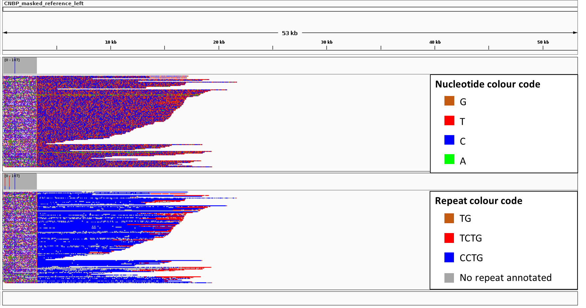

# MosaicViewer

**MosaicViewer** is a pipeline for easier visualization of expanded alleles with somatic mosaicism. Due to mosaicism, long sequencing reads can not be collapsed into an accurate consensus sequence. Therefore, only repeat annotation of each single read can be performed. MosaicViewer integrates tool for performing repeat annotation of noisy long reads, performs alignment to left and right flanking regions, and generates "simplified" reads, for easier identification of alternative motifs in IGV visualization. The pipeline has only been used for CNBP expanded alleles, but its applicability can be extended with minor modification.

<p align="center">
  
</p>

## Getting started

**Prerequisites**

* [NoiseCancellingRepeatFinder](https://github.com/makovalab-psu/NoiseCancellingRepeatFinder)
* [NanoFilt](https://github.com/wdecoster/nanofilt)
* [BBMap](https://anaconda.org/bioconda/bbmap)
* [Seqtk](https://github.com/lh3/seqtk)
* [Samtools](https://github.com/samtools/samtools)
* [Minimap2](https://github.com/lh3/minimap2)
* R with ggplot package
* A fastq file containing reads from one sample. Tested with files produced with Guppy v3.4.5 specifying ```--pt_scale TRUE``` parameter.
* A fasta file containing reference sequence (e.g. hg38)
* Coordinates of flanking regions (e.g. used for designing Crispr-Cas9 guides)

## Usage
As a first step, open the **config_MosaicViewer** file with a text editor and set all the variables. 

**MosaicViewer.sh**

Usage: ./MosaicViewer.sh

Note: the file **config_MosaicViewer.sh** should be in the same directory. It currently supports only TG, CCTG, TCTG and CCCG repeat motifs.

Outputs:

* $SAMPLE_NAME"\_trimmed\_"$SIDE".bam": bam file containing expanded reads aligned to $GENE_NAME"\_masked\_reference\_"$SIDE".fasta"
* $SAMPLE_NAME"\_trimmed\_simplified\_"$SIDE"\_final.bam": bam file containing simplified version of expanded reads aligned to $GENE_NAME"\_masked\_reference\_"$SIDE".fasta", where the sequence of each identified repeat has been replaced with a single repeated nucleotide (TG -> GG; CCTG -> CCCC; TCTG -> TTTT; CCCG -> A; other -> N)
* Other temporary files

## Results visualization

<p align="center">
  
</p>

